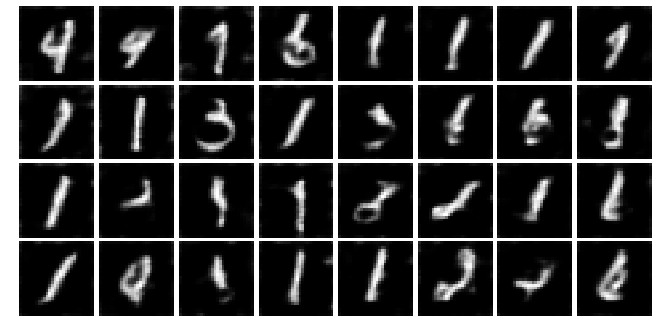

# Rick and Morty Detective

This repository contains an implementation of a Generative Adversarial Network (GAN) used for anomaly detection. The 
code is structured to allow a dataset-specific definition of a datascource and of the GAN architecture.

This repository doesn't contain standalone software but it is meant to work with Alpha-I's Watson.

This is possible because the model is wrapped in a class which implements a Detective Interface.


Repository structure
------------
The repository contains several folders, each one using a combination of datasource and models.

Directory structure:

```bash
alphai_rickandmorty_oracle/     # software package
    tflib/                      # folder containing support TensorFlow libraries
    datasource/                 # folder containing datasource examples
    architecture/               # folder containing architecture examples
    detective.py                # implementation of the AbstractDetective interface
    model.py                    # implementation of the GAN neural network
doc/                            # folder containing documentation
tests/                          # folder containing the unit tests for the package
README.md                       # this file
requirements.txt                # dependencies for the package
dev-requirements.txt            # dependencies for the development environment
```

Code structure
------------
The main two python files of the package are `detective.py` and `model.py`.

`detective.py` contains the implementation of the AbstractDetective interface from `alphai_watson`, on top of which 
this repository in built. It overrides the abstract methods `train` and `detect` and the abstract property 
`configuration`. It also adds the method `diagnose` that returns the closest synthetic chunk to the input data that the 
model model was able to generate.

`model.py` contains the TensorFlow code implementation of a generic GAN. The `RickAndMorty` class contains the 
`generator` and the `discriminator` functions, which make use of the networks architecture passed at initialisation, 
the functions responsible for training the GAN, executing the Discriminator, using the Generator to find the closest 
synthetic sample to the input data, as well running performance evaluation, and saving and loading the model.


Installation
------------

```bash
$ conda create -n rickmorty python=3.5
$ source activate rickmorty
$ pip install -r dev-requirements.txt
```

To run test
```bash
$ pytest tests/
```


Functionalities and results
------------
To demonstrate the functionalities of this repository, we use the popular MNIST dataset as a test case. Full results 
are available in the notebook `doc/notebooks/mnist_anomaly_detection.ipynb`.

In this use case, we transform the 10-digit MNIST dataset into an anomaly detection problem, by considering the digit 
`0` as the anomaly class and the other digits, `1-9`, ad the normal class.

With this setup we train our GAN-based anomaly detection model on "normal" data and test on a mixture of unseen 
normal and abnormal data. The following results correspond to a training of `10k` iterations.

### Generative power
The Generator is able to produce images that resemble digits from the normal class used for training.




### Discrimination power
Our Detective can discriminate between the normal and abnormal classes using the `detect` function of the 
`RickAndMortyDetective` class. On test data it achieves a ROC Score of 0.67, with the following classification report:


                  precision    recall  f1-score   support
    
        ABNORMAL       0.48      0.60      0.53      6903
          NORMAL       0.75      0.64      0.69     12620
    
       micro avg       0.63      0.63      0.63     19523
       macro avg       0.61      0.62      0.61     19523
    weighted avg       0.65      0.63      0.63     19523


### Root Cause Analysis
The Detective class can also be used to perform a Root Cause Analysis using the function `diagnose`. This is used to 
investigate what features of a target sample are anomalous, by evaluating to what extend the target sample could be 
reproduce by the model Generator. If the Generator fails to reproduce certain characteristics of the sample, these 
are deemed anomalous, as the Generator has not learned them in the training set.

The following image shows this functionality on the normal class. We can see that the Generator is generally able 
to create synthetic samples that closely resemble the targets.


In the image below, we now use target samples from the abnormal class. In this case, the Generator fails to reproduce 
some of the features of the target images. 


